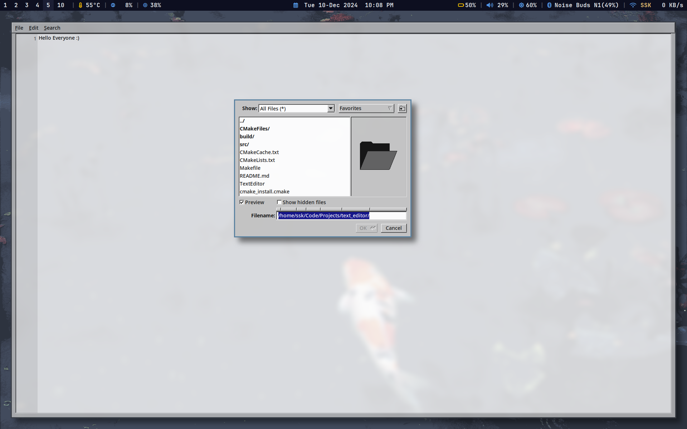

# Text Editor

A lightweight and functional text editor built using C++ and the FLTK library. This project demonstrates clean, modular design and effective use of modern C++ features for creating GUI-based applications.

## Features

- **Minimalistic Interface**: Simple and user-friendly design for ease of use.
- **Text Editing**: Supports basic text editing features such as open, save, and modify files.
- **Cross-Platform**: Built using FLTK, ensuring compatibility across Linux, Windows, and macOS.
- **Customizable**: Modular codebase allows for easy extension and addition of new features.

## Screenshots

